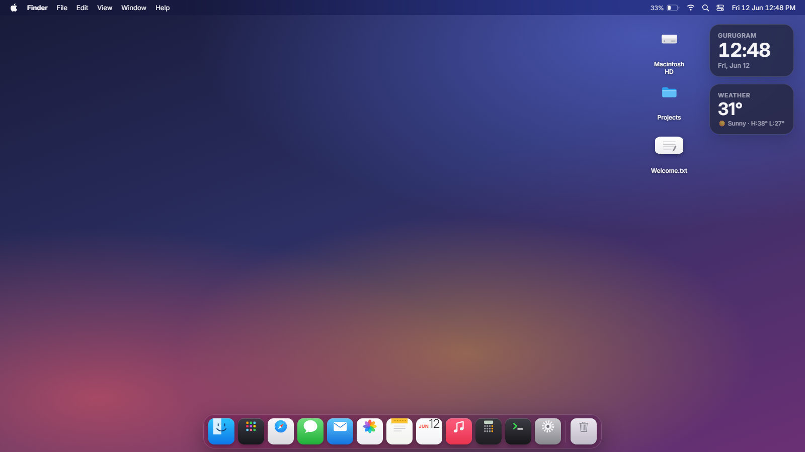
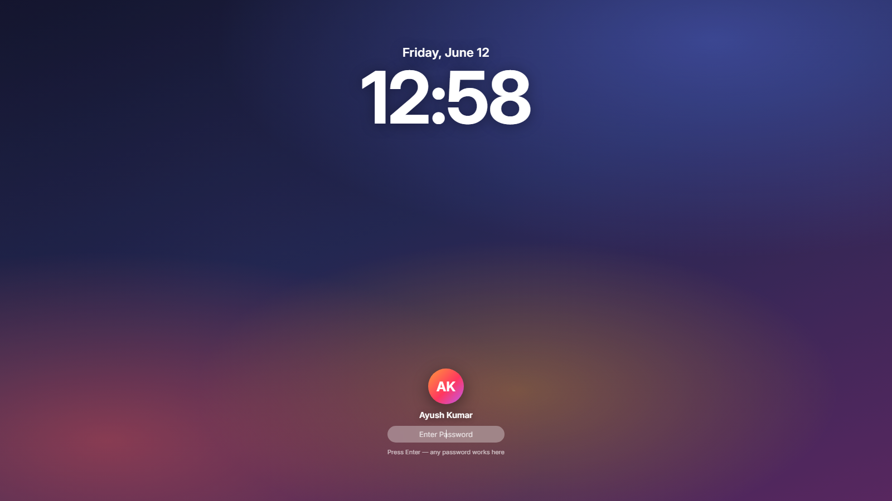
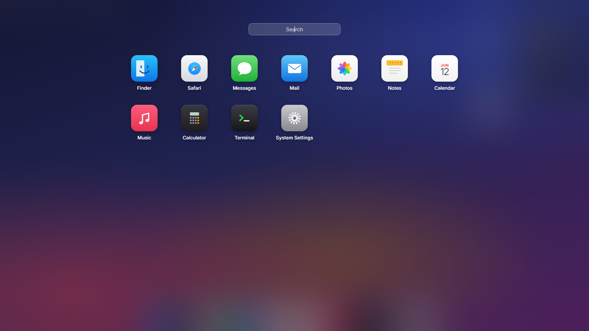
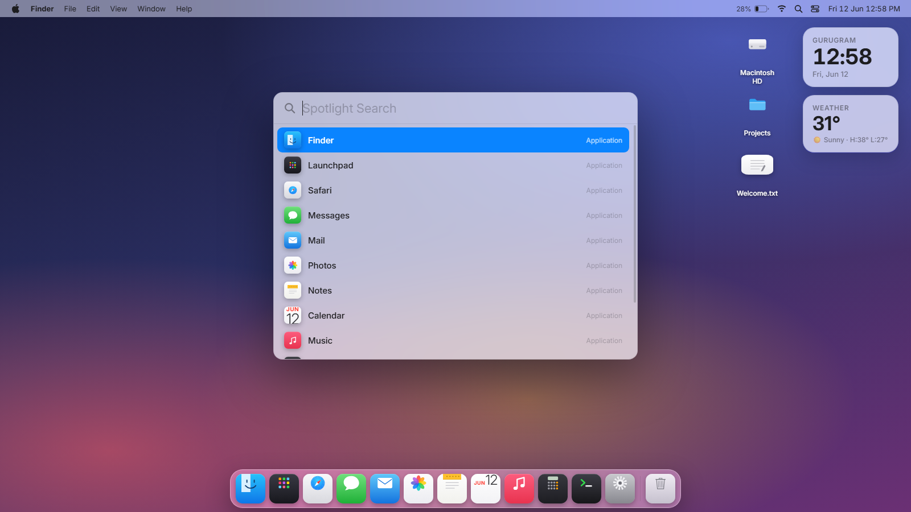
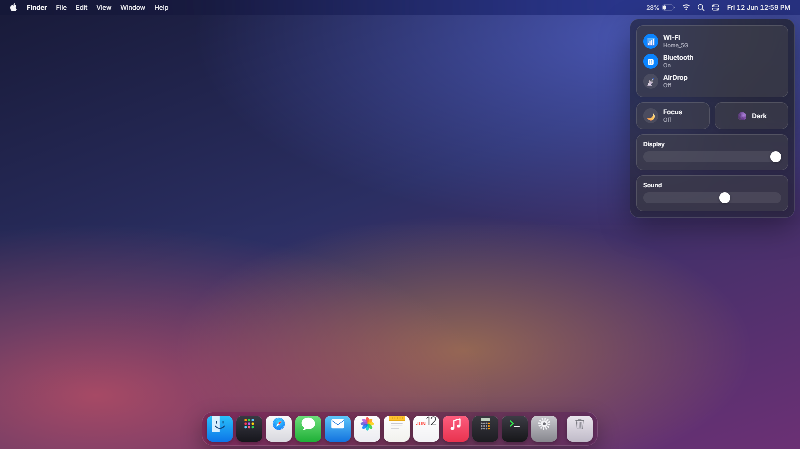
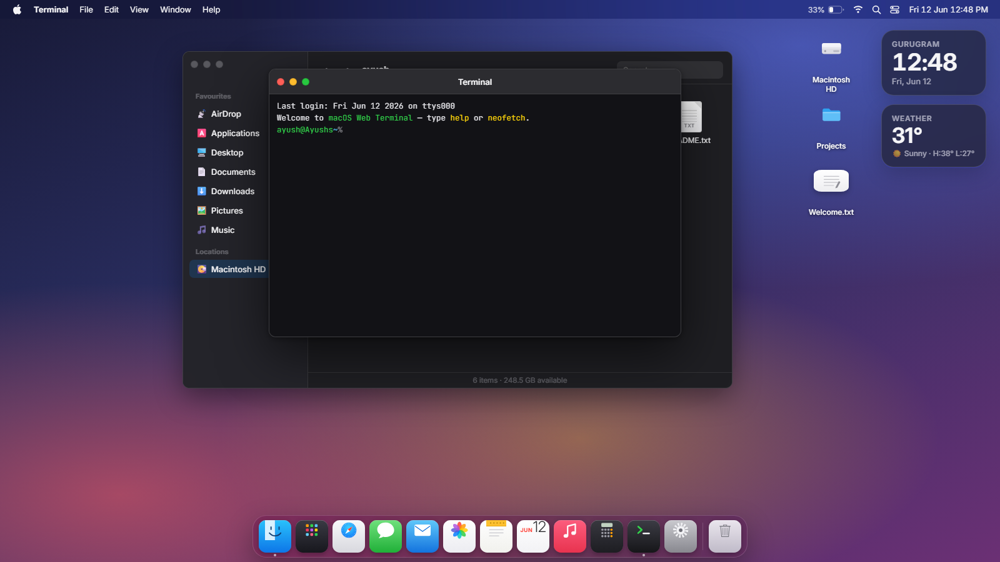
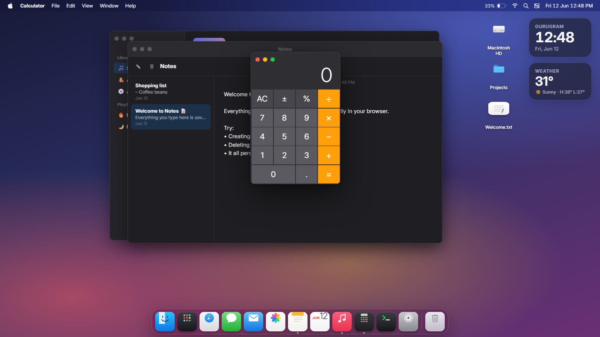
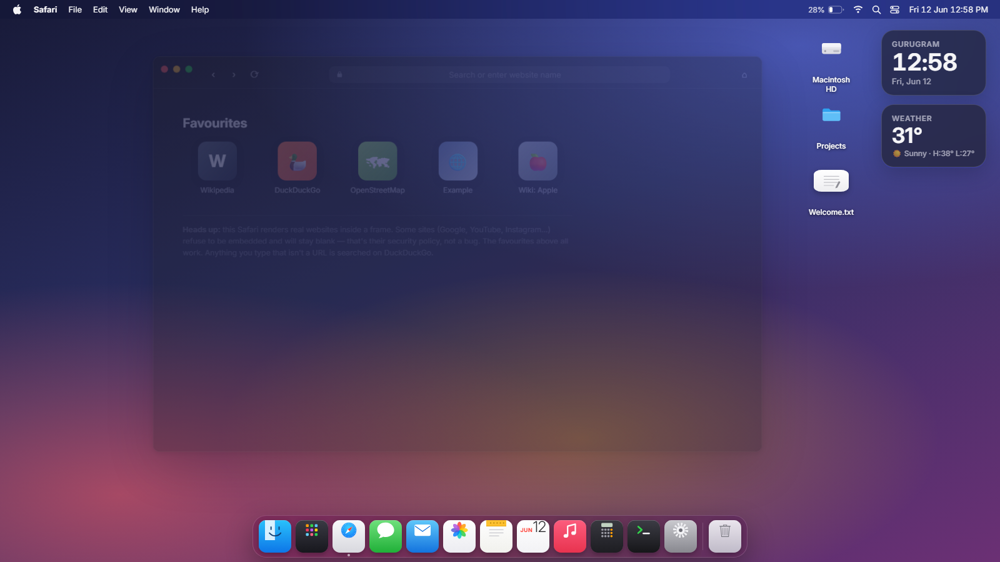
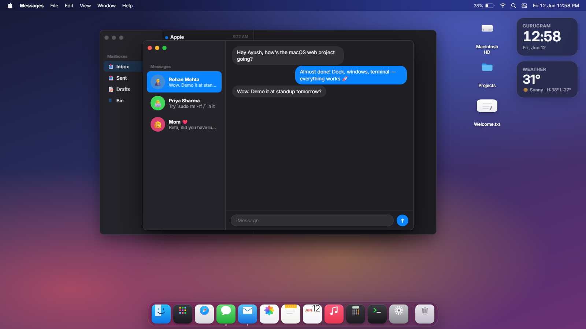
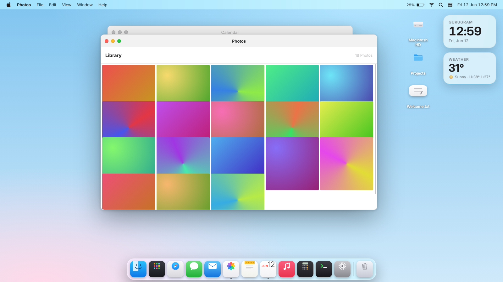

<div align="center">

# 🍎 Replica of macOS

### A pixel-faithful, fully-interactive macOS Sequoia desktop — running in your browser, or as a real Windows desktop app.

**Built with vanilla HTML / CSS / JavaScript. Zero frameworks. Zero build step.**


<br>



*Boot it. Log in. Drag windows. Play synthesised music. `sudo rm -rf /` safely.*

</div>

---

## 🖼️ Gallery

| 🔒 Lock Screen | 🚀 Launchpad |
|:---:|:---:|
|  |  |

| 🔍 Spotlight | 🎛 Control Centre |
|:---:|:---:|
|  |  |

| 📁 Finder + Terminal | 🎵 Music · Notes · Calculator |
|:---:|:---:|
|  |  |

| 🧭 Safari | 💬 Messages + Mail |
|:---:|:---:|
|  |  |

<div align="center">

### ☀️ …and a full light mode



</div>

---

## 🚀 Quick start

| Mode | How |
|---|---|
| 🌐 **Browser** *(zero setup)* | Clone → open `index.html` in Chrome / Edge |
| 🖥️ **Desktop app** *(dev)* | `npm install` → `npm start` |
| 📦 **Portable .exe** | `npm run dist` → `dist\macOS-win32-x64\macOS.exe` |

> **💡 Tips**
> - Add `#fast` to the URL to skip the boot + login animation
> - The desktop app boots **fullscreen** (Windows taskbar hidden) — `Ctrl+Q` quits,
>   `F11` toggles fullscreen,  menu → *Quit macOS* / *Shut Down…* also exit
> - Windows 11 **Smart App Control** may block self-packaged unsigned exes — if so,
>   launch with `npm start` (it uses the trusted official Electron binary)

---

## ⌨️ Keyboard shortcuts

| Shortcut | Action |
|---|---|
| `Ctrl + Space` / `⌘ + Space` | Spotlight search |
| `F4` | Launchpad |
| `Ctrl + M` | Minimise focused window |
| `Esc` | Close Spotlight / Launchpad / menus |
| `Ctrl + Q` | Quit (desktop app) |
| `F11` | Toggle fullscreen (desktop app) |

---

## ✨ Everything that works

<details open>
<summary><b>🧱 System shell</b></summary>

- **Boot screen** — Apple logo + progress bar → **lock screen** (any password logs in)
- **Live menu bar** — per-app menus that change with focus, working Apple menu,
  real battery level, Wi-Fi popover, live clock
- **The Dock** — true magnification physics (cursor-tracking cosine falloff),
  launch bounce, running-app dots, tooltips, right-click menus
- **Windows** — drag, resize from all 8 edges, traffic-light close/minimise/zoom,
  minimise *animates into the dock*, double-click titlebar to zoom, focus management
- **Spotlight** — searches apps, files and actions
- **Launchpad** — app grid with search
- **Control Centre** — Wi-Fi / Bluetooth / AirDrop / Focus toggles, brightness & volume sliders that actually work
- Notifications, macOS-style dialogs, desktop right-click menus, draggable desktop icons
- **Light/Dark mode**, 8 accent colours, 5 wallpapers, dock size & magnification — all persisted
- Apple menu → **Sleep / Restart / Shut Down** with the full boot cycle

</details>

<details open>
<summary><b>📱 15 built-in apps</b></summary>

| App | Highlights |
|---|---|
| 📁 **Finder** | Sidebar, back/forward history, search, opens files |
| 🧭 **Safari** | Loads real websites, DuckDuckGo search, favourites |
| 📝 **Notes** | Real persistent notes — survive reloads |
| 💬 **Messages** | Contacts that actually reply (and notify you) |
| ✉️ **Mail** | Inbox with read/unread states |
| 🌈 **Photos** | Generated gradient library + lightbox |
| 📅 **Calendar** | Live month view, today highlighted |
| 🎵 **Music** | **Audio synthesised live with the Web Audio API** — 5 generative tracks |
| 🔢 **Calculator** | Fully working, keyboard included |
| 🖥 **Terminal** | `ls` `cd` `cat` `neofetch` `say` … try `sudo rm -rf /` 😉 |
| ⚙️ **System Settings** | Appearance, accents, wallpapers, dock physics |
| 📄 **TextEdit / Preview** | Open text files & images from Finder |
| 🗑 **Trash** | Items collect here; Empty Trash with confirmation |
| 💻 **About This Mac** | Chip: *Claude F5 (Fable)* · Memory: *Pure imagination* |

</details>

<details open>
<summary><b>🪟 Real Windows integration (desktop app)</b></summary>

- **Finder → "This PC"** browses your *actual* files (Home, Desktop, Documents,
  Downloads, Pictures, C:) with real image thumbnails — double-click opens files
  in their real default apps, right-click → *Show in File Explorer*
- Your **real Desktop files appear as icons** on the macOS desktop
- **Detected Windows apps** (VS Code, Chrome, Edge, Notepad, PowerShell…) are pinned
  in the Dock with hand-drawn macOS-style icons, and searchable in Launchpad &
  Spotlight — one click launches the real program

</details>

---

## 📁 Project layout

```
index.html          shell markup
style.css           system chrome (menubar, dock, windows, overlays)
apps.css            per-app styles
js/system.js        window manager, dock, menubar, spotlight, power flow
js/apps.js          virtual filesystem + all 15 applications
js/main.js          desktop icons, shortcuts, boot
electron-main.cjs   Electron entry (fullscreen shell + real-files IPC)
preload.cjs         safe context-isolated bridge
```

## 🛠️ Tech notes

- **No frameworks, no build step** for the web version — three plain JS files
- Electron with `contextIsolation: true` and a minimal IPC surface
- Music is generated with `OscillatorNode` envelopes — **no audio files in the repo**
- All app icons are hand-drawn inline **SVG squircles**
- Everything persists via `localStorage` (theme, wallpaper, notes, trash…)

---

<div align="center">

**If this made you smile, leave a ⭐ — it's cheaper than a MacBook.**

Made with ❤️ and vanilla JavaScript. Not affiliated with Apple — it just looks that way.

</div>
